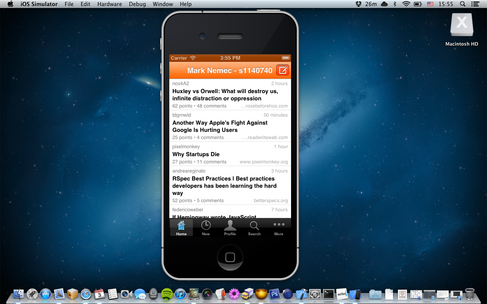

Informatics 2C - Software Engineering Assignment 1 # [news:yc](https://github.com/Xuzz/newsyc) 
===============================================================================================

## Question 1 
==============

#### What is the project for?
=============================

It is an iOS application for reading Hacker News. Hacker News is a social news website about computer hacking and startup companies, run by Y Combinator. (http://en.wikipedia.org/wiki/Hacker_News). The application gives the user options to display the current top and new submissions, his or her profile, search all submissions and save articles for reading later with [Instapaper](www.instapaper.com). #### Why did I pick this project? I picked this project because as its daily user it is in my own interest that it gets better. I have been using the application for a long time and I have missed some functionality. I am already quite familiar with working on a project in Java and I have wanted to learn programming for iOS. #### What platform did I build it on? I built it on Mac OS X Mountain Lion with Xcode 4.5.1. The project is making use of some frameworks, libraries and APIs (listed below) but as these were already included in the source code I got from GitHub, I did not have any trouble making a build. #### Frameworks, Libraries & API - [SBJson](http://stig.github.com/json-framework/) - A strict Json parser and generator for Objective-C. - [libxml2](http://www.xmlsoft.org) - Software library for parsing XML documents. - [Hacker News API](http://api.ihackernews.com) - An unofficial API for Hacker News. - [Instapaper API](http://www.instapaper.com/api) - Allows third-party applications to add URLs to Instapaper. - [MessageUI Framework](http://developer.apple.com/library/ios/#documentation/MessageUI/Reference/MessageUI_Framework_Reference/_index.html) - Contains interfaces to add message delivery capabilities without requiring the user to leave the application. - [QuartzCore Framework](http://developer.apple.com/library/mac/#documentation/graphicsimaging/reference/QuartzCoreRefCollection/_index.html) - Supports image processing and video image manipulation. - [CoreText Framework](https://developer.apple.com/library/mac/#documentation/Carbon/Reference/CoreText_Framework_Ref/_index.html) - Interface for laying out text and handling fonts. - [UIKit Framework](http://developer.apple.com/library/ios/#documentation/uikit/reference/UIKit_Framework/_index.html) - Provides the classes needed to construct and manage an application’s user interface. - [Foundation Framework](https://developer.apple.com/library/mac/#documentation/Cocoa/Reference/Foundation/ObjC_classic/Intro/IntroFoundation.html) - Defines a base layer of Objective-C classes. - [CoreGraphics Framework](http://developer.apple.com/library/ios/#documentation/coregraphics/reference/coregraphics_framework/_index.html) - Provides low-level, lightweight 2D rendering. #### Evidence of running the project I took screenshots of the application running on the iPhone simulator. To prove that I was able to build the project, I put my name and matriculation number in the navigation bar.   ## Question 2 #### How are the files organised into directories? There are 2 main directories, i.e. Resources and Classes.  **Resources directory** - Contains various resources such as images, icons, constant strings and settings that are included in iOS's Settings app. **Classes directory** - Contains multiple subdirectories, namely Experimental, Json, Categories, XML, HNKit, Instapaper, Views, Cells, Controllers and the AppDelegate and main.m files. - Experimental - Contains functionality which might be implemented some time in the future. - Json - Contains the SBJson framework. These classes are mostly used to parse data sent from the server. - Categories - Objective-C Categories (files that extend capabilities of standard 	Objective-C classes so there is no need to subclass them). - XML - Contains classes XMLDocument and XMLElement which use the libxml2 library. These are also used for parsing data. - HNKit - Classes such as HNSubmission and HNAPIRequest that communicate with the Hacker News API. - Instapaper - Classes that authenticate and later submit websites to the Instapaper API. - Views - GUI classes representing buttons, indicators and other views. - Cells - Subclasses of UITableViewCell. These are used to display different information inside lists (also called TableViews). - Controllers - Classes that control the flow of the app. - AppDelegate - Class that interacts with the operating system. - main.m - As far as I can tell, the only purpose of this file is to pass the control of the application to the AppDelegate class. Controllers directory is further split into 5 more subdirectories: -- Containers - Container controllers that contain multiple children controllers and enable the user to view hierarchical content. For example, NavigationController or MainTabController. -- Data - Controllers such as EntryListController  and CommentListController that display data like submissions and comments. -- Compose - This directory contains controllers that enable the user to compose and submit content. -- Login - Controllers that enable the user to login into their Hacker News and Instapaper accounts. -- Tabs - Contains controllers that are the children of the aforementioned container controllers such as MainTabController. #### What languages are used in the project? The whole project is written in Objective-C. There are, however some .plist files which use XML. The application fetches Json and XML files from the server and then parses them. #### Which classes (files, directories) contain what you see as the key functionality of the system? I think the most essential files are in HNKit. Classes in this directory fetch and parse the data from the server. Also very important is the AppDelegate class. Its purpose is to interact with the operating system. It also detects whether the device is an iPhone or an iPad. #### Which control the user interface? Classes inside the Controllers directory. They receive user inputs from touchscreen and load Views from the Views directory with relevant information. The four main controllers are EntryListContainer, SessionProfileController, SearchController and MoreController. ## Question 3 #### What kinds of work contributions might be useful to the project? Firstly, I think the application would benefit from implementing infinite scrolling as tapping the load more cell every time a user reaches the bottom of the list is inconvenient. This is the feature I will focus on the most. I think implementing this would require a method call that checks if the user is at the bottom of the list whenever the user finishes scrolling. I think it should be within my capabilities. Secondly, it would be useful if there was a way to jump from the submissions list straight to the linked article provided there is one. There is already a [request](https://github.com/Xuzz/newsyc/pull/80) for this feature on GitHub. However, I do not think double tap is a standard way to do this. I think I could implement this with a gesture like a swipe to the right on the list item. Thirdly, there is an interesting [bug](https://github.com/Xuzz/newsyc/issues/86) submitted on GitHub. So far I have not found what the issue might be, but I would like to fix it. Another good [idea](https://github.com/Xuzz/newsyc/issues/78) from the Github issues requests is to mark read articles. I think implementing this might involve storing IDs of read articles in some sort of cache or perhaps the iCloud. I think I might be able to implement the solution with cache. Moreover, at this time the project has no documentation. However, I would rather do something more creative than that. In the future, I think the project could make use of storyboards and/or .xib files to simplify the design of the GUI but that might be just my opinion. This would involve rewriting a big portion of the application so I do not think I will attempt to do that. Additionally, string constants are often written directly in the code. I think moving them to an xml file and then accessing them by some key would be much more practical. This would also help if at some point in the future someone decides to localise the application into different languages.
=========================================================================================================================================================================================================================================================================================================================================================================================================================================================================================================================================================================================================================================================================================================================================================================================================================================================================================================================================================================================================================================================================================================================================================================================================================================================================================================================================================================================================================================================================================================================================================================================================================================================================================================================================================================================================================================================================================================================================================================================================================================================================================================================================================================================================================================================================================================================================================================================================================================================================================================================================================================================================================================================================================================================================================================================================================================================================================================================================================================================================================================================================================================================================================================================================================================================================================================================================================================================================================================================================================================================================================================================================================================================================================================================================================================================================================================================================================================================================================================================================================================================================================================================================================================================================================================================================================================================================================================================================================================================================================================================================================================================================================================================================================================================================================================================================================================================================================================================================================================================================================================================================================================================================================================================================================================================================================================================================================================================================================================================================================================================================================================================================================================================================================================================================================================================================================================================================================================================================================================================================================================================================================================================================================================================================================================================================================================================================================================================================================================================================================================================================================================================================================================================================================================================================================================================================================================================================================================================================================================================================================================================================================================================================================================================================================================================================================================================================================================================================================================================================================================================================================================================================================================================================================================================================================================================================================================================================================================================================================================================================================================================================================================================================================================================================================================================================================================================================================================================================================================================================================================================================================

